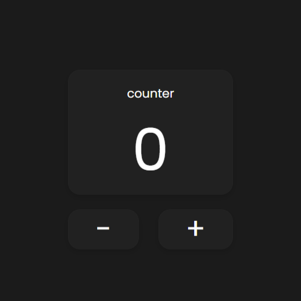

# 🚀 Counter App

Простое React-приложение "Счётчик", созданное с помощью Vite и Tailwind CSS.

 <!-- Добавь сюда ссылку на скриншот -->

## 📌 Функционал
- 📈 Увеличение и уменьшение счётчика
- 🌗 Переключение темы (светлая/тёмная)
- 🔥 Стиль на Tailwind CSS

## 🛠️ Технологии
- [React](https://react.dev/)
- [Vite](https://vitejs.dev/)
- [Tailwind CSS](https://tailwindcss.com/)

## 🚀 Демо
🔗 [Смотреть на GitHub Pages](https://alqw.github.io/react-counter/)  

## 📦 Установка и запуск
```sh
# Клонировать репозиторий
git clone https://github.com/Alqw/react-counter.git

# Перейти в папку
cd react-counter

# Установить зависимости
npm install

# Запустить в режиме разработки
npm run dev